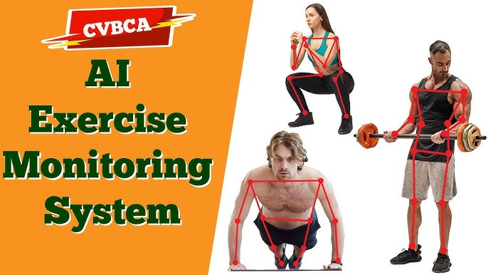
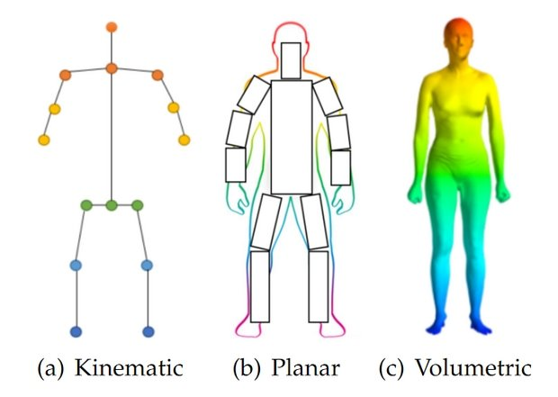
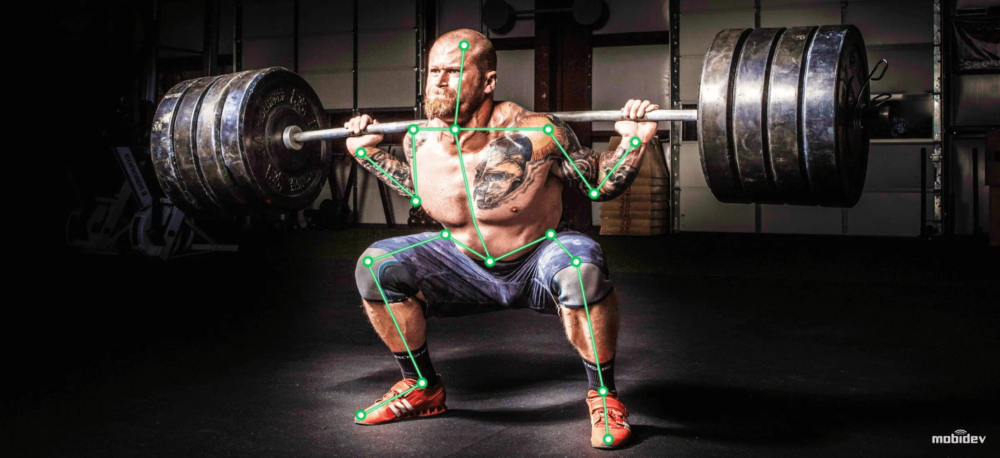
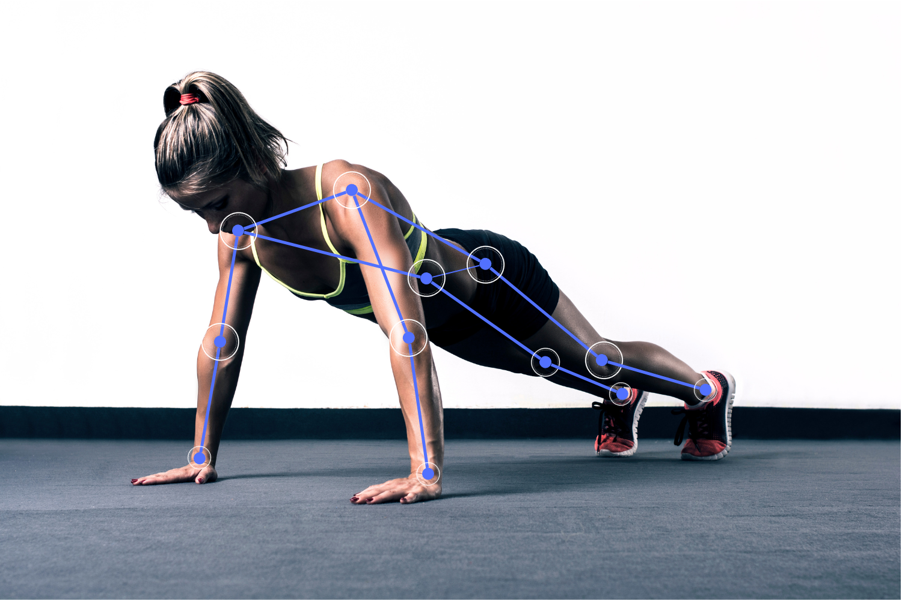

# GYMJAM



## Project Overview

Welcome to GymJam, a cutting-edge web application designed to enhance your fitness journey and help you achieve your fitness goals. It is your comprehensive companion, providing a diverse range of exercises tailored to target different body parts. With an intuitive user interface and a library of exercise variations, an immersive fitness experience that caters to users of all levels.

## Getting Started

### Prerequisites

- Desktop or Laptop:
    - Processor: Intel Core i3 or equivalent
    - Memory: 4GB RAM or higher
    - Storage: Sufficient storage capacity for the browser and temporary files
    - Display: Minimum 1366x768 resolution
    - Network: Internet connectivity for accessing the web application

- Mobile Devices:
    - Processor: Minimum dual-core processor
    - Memory: 2GB RAM or higher
    - Storage: Sufficient storage capacity for the browser and temporary files
    - Display: Minimum 720p resolution
    - Network: Internet connectivity for accessing the web application

### Installation

1. Clone the repository:

   ```bash
   git clone https://github.com/Sovik-Ghosh/GymJam.git
   ```

2. Navigate to the project directory:

   ```bash
   cd backend
   ```

3. Install dependencies (if any) and set up your development environment.
   ```bash
   pip3 -r requirements.txt
   ```
## Framework

### Mediapipe:



MediaPipe is an open-source framework developed by Google that provides a comprehensive solution for building machine learning (ML) pipelines to process multimedia data, including video, audio, and image streams. It is designed to facilitate the development of real-time perception and processing pipelines, particularly for tasks related to computer vision and media processing.

## Running the Simulation

1. Go to backend directory

2. Create a virtual environment:
    ```bash
    python3 -m venv my_env
    ```

3. Activate the virtual environment:
    ```bash
    source my_env/bin/activate
    ```
    

4. Run the code:
    ```bash
    python app.py
    ```

5. Copy and paste anyone of the url in a browser.
    - Left Bicep Curl:
        ```
        http://localhost:5000/video_feed_left
        ```
    - Right Bicep Curl:
        ```
        http://localhost:5000/video_feed_right
        ```
    - Pushup:
        ```
        http://localhost:5000/video_feed_pushup
        ```
    - Squat:
        ```
        http://localhost:5000/video_feed_squat
        ```

6. Observe and follow the instructions on the browser for the correct form of exercise.

## Exercise Overview

<div style="display: flex; justify-content: center;">
  
  
</div>

## Customizing and Extending

Feel free to customize the project to implement your strategies and behaviors for extending exercise variations.

You can modify the existing controllers or create new ones.
1. PoseModule.py is the base file containing different functions for calculating angle, tracking position, capturing video feed.
2. app.py uses flask to rendering captured webcame frames to webpage
3. pose_left.py calculates and corrects left arm bicep curl
4. pose_right.py calculates and corrects right arm bicep curl
5. pose_pushup.py calculates and corrects pushup using coordinates from the left side
6. pose_squat.py calculates and corrects squat using coordinates from the left side

Additionally, you can explore advanced features provided by Mediapipe.

## Contributing

If you would like to contribute to this project, please follow our [contribution guidelines](CONTRIBUTING.md). We welcome bug reports, feature requests, and pull requests.

## License

This project is licensed under the [Apache License 2.0](LICENSE).
